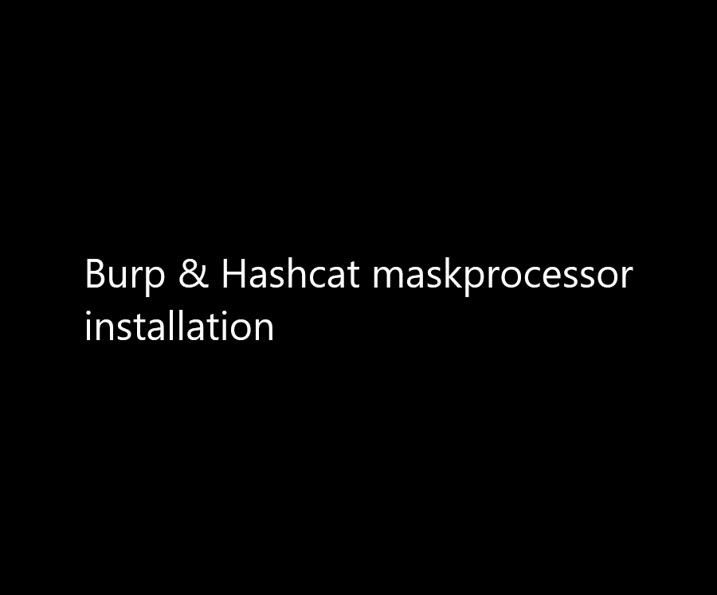
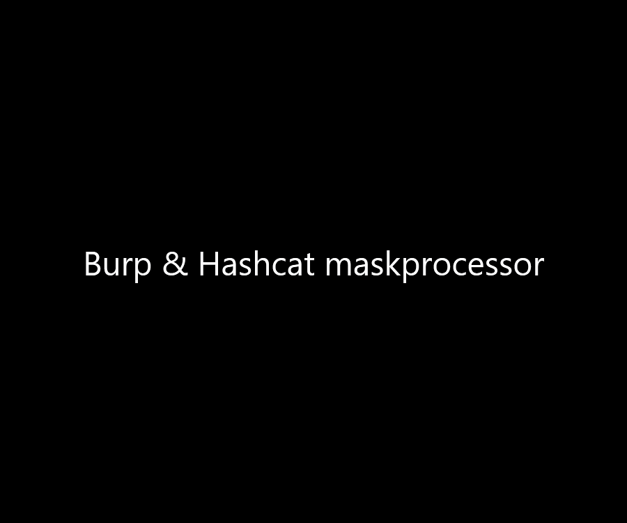

# burp-intruder-hashcat-maskprocessor

Burp Hashcat Maskprocessor Extension, inspired by hashcat maskprocessor https://github.com/hashcat/maskprocessor 

Python code credits to https://github.com/Xvezda/python-maskprocessor (https://pypi.org/project/maskprocessor/) thank you. 

I could use python ```pip install maskprocessor``` on jython and ```import maskprocessor```, but this is easier installation.

My credit goes to Burp Extension self.


How to Install:




How to Use:




Maskprocessor how to
==============
(cloned from https://github.com/hashcat/maskprocessor/blob/master/README.md and edited)

High-Performance word generator with a per-position configureable charset

Mask attack
--------------

Try all combinations from a given keyspace just like in Brute-Force attack, but more specific.


Masks
--------------

For each position of the generated password candidates we need to configure a placeholder. If a password we want to crack has the length 8, our mask must consist of 8 placeholders.

- A mask is a simple string that configures the keyspace of the password candidate engine using placeholders.
- A placeholder can be either a custom charset variable, a built-in charset variable or a static letter.
- A variable is indicated by the ? letter followed by one of the built-in charset (l, u, d, s, a) or one of the custom charset variable names (1, 2, 3, 4).
- A static letter is not indicated by a letter. An exception is if we want the static letter ? itself, which must be written as ??.

Built-in charsets
--------------

- ?l = abcdefghijklmnopqrstuvwxyz
- ?u = ABCDEFGHIJKLMNOPQRSTUVWXYZ
- ?d = 0123456789
- ?s = «space»!"#$%&'()*+,-./:;<=>?@[\]^_`{|}~
- ?a = ?l?u?d?s
- ?b = 0x00 - 0xff

Custom charsets
--------------

There are four commandline-parameters to configure four custom charsets.

- --custom-charset1=CS
- --custom-charset2=CS
- --custom-charset3=CS
- --custom-charset4=CS

These commandline-parameters have four analogue shortcuts called -1, -2, -3 and -4. You can specify the chars directly on the command line.

**Password length increment** (Not yet)
--------------

Example
--------------

The following commands creates the following password candidates:

- command: ?l?l?l?l?l?l?l?l
- keyspace: aaaaaaaa - zzzzzzzz

- command: -1 ?l?d ?1?1?1?1?1
- keyspace: aaaaa - 99999

- command: password?d
- keyspace: password0 - password9

- command: -1 ?l?u ?1?l?l?l?l?l19?d?d
- keyspace: aaaaaa1900 - Zzzzzz1999

- command: -1 ?dabcdef -2 ?l?u ?1?1?2?2?2?2?2
- keyspace: 00aaaaa - ffZZZZZ

- command: -1 efghijklmnop ?1?1?1
- keyspace: eee - ppp
